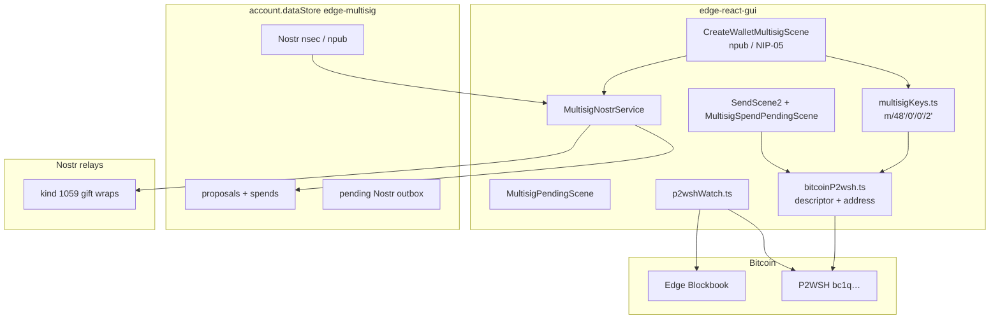

# Edge Bitcoin P2WSH multisig

Public reference for Edge developers reviewing **native Bitcoin P2WSH multisig** in Edge React GUI. This work was done by **David Coen** with [Cursor](https://cursor.com) as a prototype/demo (**Edge Grana** APK, `app.edge.grana`) on top of Edge `4.50.0`.

**Share this repo** with Edge staff. Application code lives on the linked GUI branch. The Nostr **coordination protocol** (why encrypted DMs, message types, threat model) is specified separately — see the table.

| Component | Repository | Branch / notes |
|-----------|------------|----------------|
| **React GUI** (create/import/spend UI, BIP-48 keys, Blockbook watch, Nostr client) | [theDavidCoen/edge-react-gui](https://github.com/theDavidCoen/edge-react-gui) | [`multisig`](https://github.com/theDavidCoen/edge-react-gui/tree/multisig) |
| **This document** (Edge implementation) | [theDavidCoen/edge-bitcoin-multisig](https://github.com/theDavidCoen/edge-bitcoin-multisig) | `main` |
| **Coordination protocol** (Nostr layer, not Edge-specific) | [theDavidCoen/nostr-multisig-coordination](https://github.com/theDavidCoen/nostr-multisig-coordination) | `main` |

Upstream base (for merge planning):

- GUI: [EdgeApp/edge-react-gui](https://github.com/EdgeApp/edge-react-gui) @ `4.50.0`

No changes are required in `edge-currency-plugins` for receive/spend of the **shared P2WSH**. The existing Bitcoin bip49 wallet is only a **shell** (UI, seed storage, sync). Shared funds live on a BIP-67 P2WSH script watched via Blockbook from the GUI.

---

## Why this belongs in Edge

1. **From-scratch multisig is an Edge-user product.** New wallets are created by inviting other Edge accounts (Nostr `npub` or NIP-05). That is intentional, not an unfinished xpub form.
2. **Coordination without a coordinator server.** Invites, acceptances, and cosignature requests travel as encrypted Nostr DMs (NIP-17 gift wraps). Relays never see xpubs or PSBTs in plaintext.
3. **On-chain keys stay BIP-48.** The same BIP-39 seed shown as Master Private Key / Raw Keys `bitcoinKey` derives both the bip49 shell and the cosigner account `m/48'/0'/0'/2'`. The descriptor origin is not a cosmetic label — the serialized xpub is depth 4, index `2'`.
4. **Recovery is still open.** BIP-380 descriptors and BIP-129 BSMS can be exported and imported (paste). Watching or restoring an existing script does not require the other cosigners to be Edge users.

---

## 1. Edge-only from-scratch creation (entropy)

Pasting an xpub from another app into **Create** would let that app’s key material into a brand-new script. Some third-party wallets have shipped with **insufficient entropy** (the **Coincard** case). A well-formed xpub from a weak RNG still looks like a valid cosigner. The resulting multisig can be weaker than it appears, including related-key / reduced-search-space failures that are invisible in the UI.

**Policy in this prototype**

| Path | Allowed | Why |
|------|---------|-----|
| Create from scratch | Edge `npub` / NIP-05 only | Every cosigner key is derived inside Edge from a BIP-39 `bitcoinKey` |
| Invite by pasted xpub | **Hidden** (`ENABLE_MULTISIG_XPUB_INVITE = false`) | Avoids importing low-entropy foreign keys at creation time |
| Import descriptor / BSMS | Yes (paste) | Recovery / watch of a script that already exists |
| Export descriptor / BSMS | Yes | Interop with Sparrow, Specter, etc. |

The xpub invite path is **still implemented** in `startMultisigWallet({ mode: 'xpub' })` so it can be re-enabled later (for example behind a developer flag or after an entropy warning). Do not treat the hidden UI as deleted code.

NIP-05 is resolved over HTTPS (`/.well-known/nostr.json`) to an `npub`, then the invite is sent to that `npub`. NIP-05 is not a Bitcoin key and is not written into the on-chain descriptor.

---

## 2. Product model

```
Edge Bitcoin wallet (bip49 shell)
  bitcoinKey  ──►  m/49'/0'/0'     UI / legacy singlesig addresses (not the shared funds)
                └►  m/48'/0'/0'/2'  cosigner xpub in the P2WSH descriptor
```

- **Shell wallet:** `walletType: wallet:bitcoin-bip49`, `keyOptions: { format: 'bip49' }`. Created so Edge has a normal Bitcoin wallet row, seed backup, and password gating.
- **Shared funds:** native segwit P2WSH (`wsh(sortedmulti(m, …))`), BIP-67 pubkey sort, receive at `m/0/i` under each account xpub (descriptor multipath `/<0;1>/*`).
- **Balance / history / receive address** for the shared script come from Blockbook in the GUI (`p2wshWatch.ts`), not from the bip49 engine UTXO set.
- **Nostr** is transport and UX only. Losing the nsec does not lose Bitcoin; losing `bitcoinKey` does.

---

## 3. Architecture overview



---

## 4. GUI map (`src/`)

| Path | Role |
|------|------|
| `actions/MultisigActions.ts` | Create, import, accept/decline, repair BIP-48, spend request / partial / broadcast |
| `actions/MultisigExportActions.tsx` | Password-gated descriptor / BSMS export |
| `components/scenes/CreateWalletMultisigScene.tsx` | m-of-n, npub or NIP-05, confirm screen |
| `components/scenes/CreateWalletImportScene.tsx` | Seed + descriptor/BSMS paste |
| `components/scenes/MultisigPendingScene.tsx` | Join / wait for cosigners |
| `components/scenes/MultisigSpendPendingScene.tsx` | Approve / reject PSBT |
| `components/scenes/NostrAccountScene.tsx` | npub, nsec reveal, NIP-05 display name |
| `components/services/MultisigNostrService.tsx` | Inbox, outbox flush, BIP-48 repair on login |
| `util/multisig/multisigKeys.ts` | Derive BIP-48 from `bitcoinKey` via `deriveChild` (no path-string apostrophe issues on Hermes) |
| `util/multisig/bitcoinP2wsh.ts` | Normalize SLIP-132 keys, BIP-67 script, descriptor build/parse, **refuse to stamp `48'/0'/0'/2'` on a non-BIP-48 xpub** |
| `util/multisig/parseImport.ts` | Descriptor / BSMS parse; seed match prefers real BIP-48 bytes over origin labels |
| `util/multisig/spendPsbt.ts` | Build/sign/finalize PSBT; Blockbook broadcast |
| `util/multisig/p2wshWatch.ts` | Watch receive gap, balance, incoming txs |
| `util/multisig/exportInfo.ts` | Export payload; drop stored descriptors whose origin disagrees with xpub depth/index |
| `util/nostr/*` | Identity, NIP-17, NIP-44, NIP-05 lookup, relay pool, outbox |
| `locales/en_US.ts` | All user-visible copy (English source) |

Create-wallet list: `getCreateWalletList.ts` adds **Bitcoin (Multisig)** with `isMultisig: true`. Mixing Multisig with another asset in the same create flow is rejected (`multisig_cannot_mix_assets`).

---

## 5. Keys (must match the seed UI)

Master Private Key and Raw Keys `bitcoinKey` are the **bip49 shell seed** (12/24 words). That seed **must** also produce the BIP-48 account xpub used on-chain.

| Check | Expected |
|-------|----------|
| BIP-32 depth of local cosigner xpub | `4` |
| Child index | `2'` (`0x80000002`) |
| Path | `m/48'/0'/0'/2'` |
| Same seed, BIP-49 account | `m/49'/0'/0'` — **different** xpub, depth 3 |

`buildMultisigDescriptor` throws if asked to label a non-BIP-48 xpub as `48'/0'/0'/2'`. Import matching uses the derived xpub bytes, not the origin string in the descriptor (old wallets could stamp `48'` on a BIP-49 node).

Fingerprint in `[fp/48'/0'/0'/2']` is the **master fingerprint** when the root is depth 0.

---

## 6. Create / import / spend (Edge UX)

### 6.1 Create

1. Select **Bitcoin (Multisig)** → name → m-of-n.
2. Each other cosigner: paste **npub** or **NIP-05** (`name@domain`, or a bare domain → `_@domain`).
3. **Next** resolves NIP-05 over HTTPS, then loads kind 0 from relays for display names.
4. **Confirm cosigners** shows NIP-05 next to the resolved npub.
5. **Create** makes the bip49 shell, stores a pending proposal, gift-wraps `edge-multisig-invite` to each npub.

The invite JSON (plaintext inside NIP-17) is documented in [nostr-multisig-coordination](https://github.com/theDavidCoen/nostr-multisig-coordination). Edge does **not** put NIP-05 in the wire message — only the resolved npub.

### 6.2 Accept

Invitee sees an in-app notification → pending scene → slide to join. Edge derives their BIP-48 xpub from **their** shell seed and publishes `edge-multisig-accept`. When every slot has an xpub, the initiator publishes `edge-multisig-complete` and all clients derive the same P2WSH.

### 6.3 Import

Paste BIP-380 `wsh(sortedmulti(…))` or wallet BSMS 1.0 plus the local seed. Signer-only BSMS (`00` + one xpub) is rejected. The seed must match one cosigner (BIP-48 preferred, legacy BIP-49 allowed for old scripts).

### 6.4 Spend

Send from the shell wallet row is intercepted: GUI builds a P2WSH PSBT, partial-signs locally, gift-wraps `edge-multisig-spend-request`. Other devices sign (`-partial`) or reject. When `m` signatures exist, the last required signer finalizes and broadcasts via Blockbook.

Legacy BIP-49 cosigner keys (pre-BIP-48 wallets) still sign through `legacyBip49` in `spendPsbt.ts`.

---

## 7. Persistence

Store id: `edge-multisig` on `account.dataStore`.

| Key | Contents |
|-----|----------|
| `identity` | nsec hex, npub, optional display name / NIP-05 |
| `proposals` | Create/join state, cosigner xpubs, descriptor, P2WSH address |
| `spends` | In-flight PSBTs and signer status |
| `onchain-{walletId}` | Compact on-chain snapshot for watch |
| `pendingNostrOutbox` | Gift wraps to retry if a relay publish fails |

The Nostr secret is **not** derived from `bitcoinKey`. It is created with `schnorr.utils.randomSecretKey()` on first use (`ensureNostrIdentity`). Users can replace it from Settings → Nostr Account by importing an `nsec`.

---

## 8. Relays and Blockbook

Default Nostr relays (`util/nostr/relayPool.ts`):

- `wss://relay.damus.io`
- `wss://nos.lol`
- `wss://relay.primal.net`

Inbox is kind **1059** gift wraps tagged `p` = this device’s pubkey. Profiles are kind **0** via a one-shot `queryRelays` so they do not disturb the inbox subscription.

P2WSH watch uses the same Edge Blockbook bases as Bitcoin (`getBlockbookBases`).

---

## 9. Tests

```bash
cd edge-react-gui
npm test -- --testPathPatterns='multisig|nip05|nostrMultisig' --watchAll=false
```

Coverage includes BIP-48 depth/index vs origin labels, descriptor checksums, import matching, NIP-05 well-known lookup, NIP-17 wrap/unwrap, and PSBT 2-of-3.

---

## 10. Grana release APK (local QA)

```bash
export ANDROID_HOME=/home/david/.android-sdk
export JAVA_HOME=/usr/lib/jvm/java-17-openjdk
export GRADLE_USER_HOME=/home/david/.gradle
cd edge-react-gui/android
./gradlew assembleRelease -PreactNativeArchitectures=arm64-v8a
# APK: app/build/outputs/apk/release/app-release.apk
# applicationId: app.edge.grana
```

Not a production Edge Play Store build.

---

## 11. Suggested merge checklist for Edge

- [ ] Security review: Nostr nsec in `dataStore`, NIP-17 to public relays, Blockbook for P2WSH
- [ ] Confirm BIP-48 derivation from `bitcoinKey` (depth 4 / index `2'`) on device, not only unit tests
- [ ] Product sign-off: Edge-only from-scratch invites (Coincard / entropy rationale)
- [ ] Decide whether xpub-create returns behind a warning, never, or export-only
- [ ] Import/export interop: Sparrow / Specter descriptor + BSMS
- [ ] Copy review for pending invite, spend request, and receive (P2WSH ≠ bip49 address)
- [ ] Hermes: BIP-48 uses `deriveChild`, not a path string containing `'`

---

## 12. Contact

**David Coen** · prototype for Edge review (built with Cursor).

On-chain scripts follow BIP-48, BIP-67, BIP-174/370 (PSBT), BIP-380, BIP-129. Coordination messages are specified in [nostr-multisig-coordination](https://github.com/theDavidCoen/nostr-multisig-coordination).
